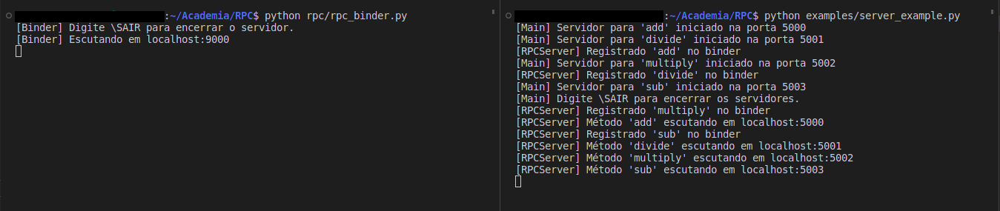
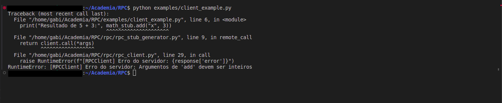
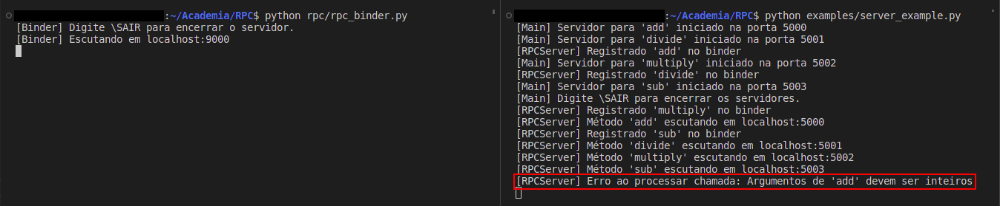
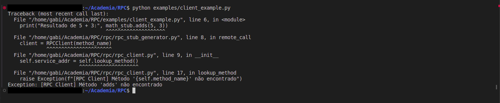
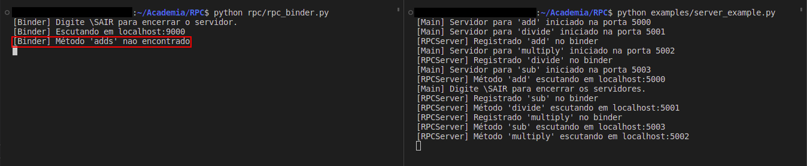

# RPC - Remote Procedure Call (Chamadas de Procedimento Remoto)

Este projeto implementa um sistema simples de RPC (Remote Procedure Call) em Python, permitindo que métodos de um serviço possam ser chamados remotamente por meio de sockets TCP, de maneira transparente para o cliente. Como exemplo prático, o projeto implementa uma calculadora que realiza as quatro operações básicas: adição, subtração, multiplicação e divisão.

## Introdução

RPC (Remote Procedure Call) é um mecanismo que permite que funções ou métodos sejam executados em outro processo ou máquina como se fossem chamadas locais. Neste projeto, o cliente realiza chamadas como `math_stub.add(5, 3)` e os parâmetros são enviados ao servidor, que executa o método correspondente e retorna o resultado. Nesse exemplo prático, cada operação matemática, ou seja cada método, vai executar em um servidor diferente.

O sistema é composto por:

- **Binder**: Responsável por manter um registro dos métodos disponíveis e os endereços dos servidores correspondentes.
- **Servidor RPC (`RPCServer`)**: Registra um método no binder e escuta requisições do cliente.
- **Cliente RPC (`RPCClient`)**: Busca o endereço do método no binder e envia a requisição.
- **Stub**: Gera dinamicamente chamadas remotas de forma transparente para o usuário.

---

## Estrutura do Projeto
```
RPC/
├── examples/
│ ├── server_example.py # Exemplo de servidor com múltiplos métodos
│ └── client_example.py # Exemplo de cliente usando o stub
├── interface/
│ └── math_service.py # Implementação dos métodos 'add', 'sub', 'multiply', 'divide'
├── rpc/
│ ├── binder.py # Servidor central que registra e resolve serviços
│ ├── rpc_server.py # Classe do servidor RPC
│ ├── rpc_client.py # Classe do cliente RPC
│ ├── rpc_stub_generator.py # Stub dinâmico
│ └── serializer.py # Serialização e desserialização com pickle
```

## Como executar

### Requisitos
1. Python (>= 3.7)

### Passo a Passo
1. Em um terminal, inicie o servidor do Binder. Por padrão, o binder é iniciado na porta 9000.

```bash
python rpc/rpc_binder.py
```

2. Em outro terminal, inicie os servidores dos métodos. As portas dos métodos são definidas automaticamente a partir da porta base 5000.
```bash
python examples/server_examples.py
```

3. Por fim, em outro terminal, execute o cliente.
```bash
python examples/client_examples.py
```

**OBS.:** Para sair dos servidores (binder e servidores dos métodos) basta digitar "\SAIR" no terminal.

## Exemplo de execução

Com o seguinte bloco de execução no cliente (`examples/client_example.py`) que instancia o stub e acessa os métodos:
```python
from rpc.rpc_stub_generator import Stub

if __name__ == "__main__":
    math_stub = Stub()
    
    print("Resultado de 5 + 3:", math_stub.add(5, 3))
    print("Resultado de 4 * 2:", math_stub.multiply(4, 2))
    print("Resultado de 5 - 3:", math_stub.sub(5, 3))
    print("Resultado de 4 / 2:", math_stub.divide(4, 2))

```

1. Executa-se o servidor do binder e os servidor RPC juntamente com os métodos.
```bash
python rpc/rpc_binder.py
```

```bash
python examples/server_example.py
```



3. O programa do cliente é executado com:
```bash
python examples/client_example.py
```


## Inserção de novos serviços à biblioteca MathService
1. Insira o método do serviço na classe `MathService` (arquivo `interface/math_service.py`). No exemplo, foi utilizado a adição do serviço de multiplicação.
```python
def multiply(self, a, b):
    if not isinstance(a, int) or not isinstance(b, int):
        raise ValueError("Argumentos de 'multiply' devem ser inteiros")
    return a * b
```

3. Para utilizar o serviço no cliente, basta acessá-lo com `math_stub.multiply(4,2)` no arquivo `examples/client_example.py`.
```python
print("Resultado de 1 * 4:", math_stub.multiply(4, 2))
```

4. Execute todos os servidores conforme no tópico "Como executar".

## Validação de tipos dos argumentos
Os métodos implementados na classe `MathService` (arquivo `interface/math_service.py`) verificam se os argumentos são inteiros. Caso argumentos inválidos sejam enviados, o erro é tratado no servidor e repassado ao cliente.

Exemplo de execução com a seguinte chamada:
```python
math_stub.add("x", 3)
```

Gera a saída ao cliente:



E também gera o erro nos logs dos servidores (`examples/server_example.py`):



## Validação de métodos
Quando o cliente tenta chamar um método inexistente, como `math_stub.adds(1, 2)` (note o adds com "s" a mais), o `RPCClient` não encontra o método registrado no binder. Nesse caso, o erro ocorre ainda no lado do cliente, pois o binder não retorna um endereço válido para o método solicitado.

Exemplo de execução com a seguinte chamada:
```python
math_stub.adds(1, 2)
```

Gera a saída ao cliente:



Além disso, o erro é registrado nos logs do binder (`rpc/rpc_binder.py`)


